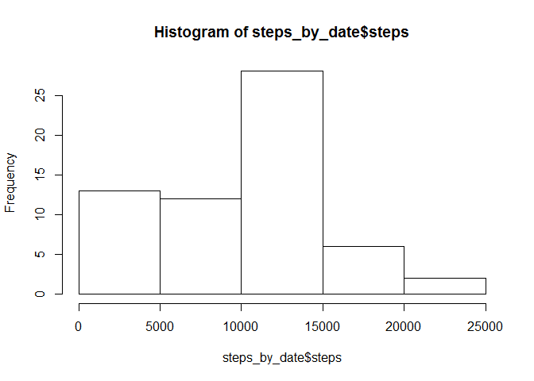

# Reproducible Research: Peer Assessment 1
Loading and preprocessing the data

```r
setwd("C:/Users/Next Step/Documents")
activity=read.csv("activity.csv")
library(dplyr)
```

```
## 
## Attaching package: 'dplyr'
## 
## The following objects are masked from 'package:stats':
## 
##     filter, lag
## 
## The following objects are masked from 'package:base':
## 
##     intersect, setdiff, setequal, union
```

```r
gp_by_date=group_by(activity,date)
steps_by_date=summarize(gp_by_date,steps=sum(steps,na.rm=TRUE))
hist(steps_by_date$steps)
```

 
  
What is mean total number of steps taken per day?

```r
mean_steps=mean(steps_by_date$steps)
median_steps=median(steps_by_date$steps)
```
The mean total number of steps taken is 9354.2295082.  
The median total number of steps taken is 10395.

What is the average daily activity pattern?

```r
gp_by_interval=group_by(activity,interval)
steps_by_interval=summarize(
        gp_by_interval,steps=mean(steps,na.rm=TRUE)
        )
plot(steps_by_interval$interval,steps_by_interval$steps,"l")
```

 

```r
max_val=max(steps_by_interval$steps)
max_interval=steps_by_interval$interval[steps_by_interval$steps==max_val]
num_of_nas=sum(is.na(activity$steps))
```
The 5 minute interval that has the largest average number of steps taken is 835.

Inputing missing values: have been replaced with the mean for that interval across all dates.

```r
new_activity=activity
len=length(activity$steps)
for (i in 1:len) {
        if(is.na(activity$steps[i])){
                new_activity[i,1]=steps_by_interval[(i-1)%%288+1,2]
                } 
}
ngp_by_date=group_by(new_activity,date)
nsteps_by_date=summarize(ngp_by_date,steps=sum(steps,na.rm=TRUE))
hist(nsteps_by_date$steps)
```

 

```r
nmean_steps=mean(nsteps_by_date$steps)
nmedian_steps=median(nsteps_by_date$steps)
```
There were many days for which the data was entirely missing. These contributed to multiple 0 values in the histogram. In the new histogram, these false 0's have been replaced with the averages. The mean is much higher and as indicated by the closeness between the new mean 1.0766189\times 10^{4} and the new median 1.0766189\times 10^{4}, the skewing has largely disappeared. The distribution is more or less symmetrical.

Are there differences in activity patterns between weekdays and weekends?

```r
my_weekday=function(date) if(as.POSIXlt(date)$wday<6&as.POSIXlt(date)$wday>0){
        "weekday"} else "weekend"
kind.of.day=lapply(activity$date, my_weekday)
new_activity$kind.of.day=kind.of.day
new_activity_wkday=new_activity[new_activity$kind.of.day=="weekday",1:3]
new_activity_wkend=new_activity[new_activity$kind.of.day=="weekend",1:3]
wkday_gp_by_interval=group_by(new_activity_wkday,interval)
wkday_steps_by_interval=summarize(
        wkday_gp_by_interval,steps=mean(steps,na.rm=TRUE)
        )
wkend_gp_by_interval=group_by(new_activity_wkend,interval)
wkend_steps_by_interval=summarize(
        wkend_gp_by_interval,steps=mean(steps,na.rm=TRUE)
        )
plot(wkday_steps_by_interval$interval,wkday_steps_by_interval$steps,"l",col=2)
lines(wkend_steps_by_interval$interval,wkend_steps_by_interval$steps,"l",col=3)
```

 

```r
par(mfrow=c(2,1))
plot(wkday_steps_by_interval$interval,wkday_steps_by_interval$steps,"l")
plot(wkend_steps_by_interval$interval,wkend_steps_by_interval$steps,"l")
```

 
  
As can be seen from the plots (in the first one, the red is weekday and the green is weekend), except for an inital burst of activity at the beginning of the day during weekdays, activity is typically at a  higher level for most of the day.
